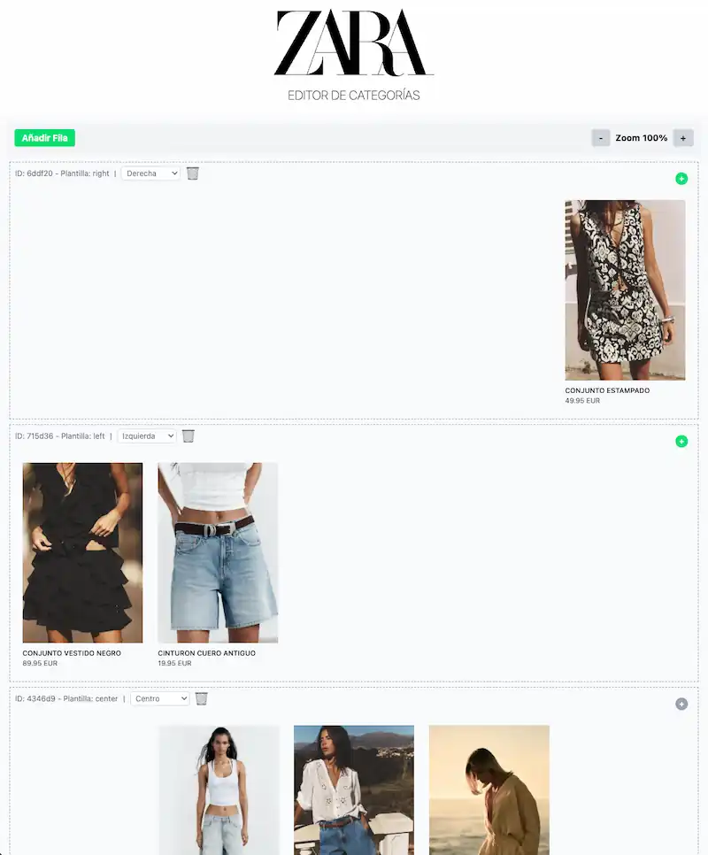

# 🛒 Not A Zara Product Frontend - Editor de Categorías


## 📝 Descripción

Editor visual de categorías para e-commerce que permite organizar productos en filas con diferentes plantillas de alineación.

## ✨ Características

- **Gestión de Filas**: Añadir y eliminar filas de productos
- **Reordenación de Filas**: Arrastra y suelta filas para cambiar su orden
- **Plantillas de Alineación**: Organizar productos con alineación izquierda, centro o derecha
- **Gestión de Productos**: Añadir y eliminar productos en cada fila (máximo 3 por fila)
- **Reordenación y Movimiento de Productos**: Arrastra productos para reordenarlos dentro de una fila o moverlos entre filas
- **Drag Overlay Inteligente**: El elemento arrastrado se muestra con un overlay que respeta el nivel de zoom del editor para una experiencia visual coherente
- **Control de Zoom**: Ajustar el nivel de zoom para visualizar mejor el diseño
- **Vista Previa**: Ver el diseño final de la categoría en una vista previa
- **UI Responsiva**: Interfaz adaptable a diferentes tamaños de pantalla
- **Mejoras UX**: Botones de borrado más accesibles y feedback visual durante el drag and drop

## 🛠️ Tecnologías

- **React**: Biblioteca para construir interfaces de usuario
- **TypeScript**: Tipado estático para JavaScript
- **Zustand**: Gestión de estado ligera y sencilla
- **TailwindCSS**: Framework CSS utilitario
- **Vite**: Herramienta de construcción rápida
- **@dnd-kit/core & @dnd-kit/sortable**: Librerías para drag and drop avanzado y accesible

## 🏗️ Arquitectura

```
src/
├── features/
│   └── category-editor/     # Módulo principal
│       ├── components/      # Componentes UI (filas, productos, toolbar)
│       └── types.ts         # Definiciones de tipos
└── store/
    └── categoryStore.ts     # Estado global con Zustand
```

### 🧩 Sistema Drag and Drop

- **Contexto Único**: Un solo `DndContext` en el editor gestiona todas las operaciones de drag and drop para filas y productos.
- **Overlay Escalable**: El overlay que sigue al cursor durante el drag se escala dinámicamente según el nivel de zoom para mantener la coherencia visual.
- **Soporte para Reordenación y Movimiento**: Puedes reordenar filas, reordenar productos dentro de la misma fila, o mover productos entre filas arrastrando y soltando.
- **Tipado Estricto**: El sistema diferencia entre drag de filas y de productos para evitar errores y mejorar la mantenibilidad.

## 🚀 Instalación y Uso

```bash
# Clonar el repositorio
git clone https://github.com/samuhlo-training/not-a-zara-product-frontend.git

# Instalar dependencias
npm install

# Iniciar servidor de desarrollo
npm run dev
```

## 📸 Vista Previa

<p align="center">
  
</p>
---

Desarrollado como prueba por Samu Lo.
